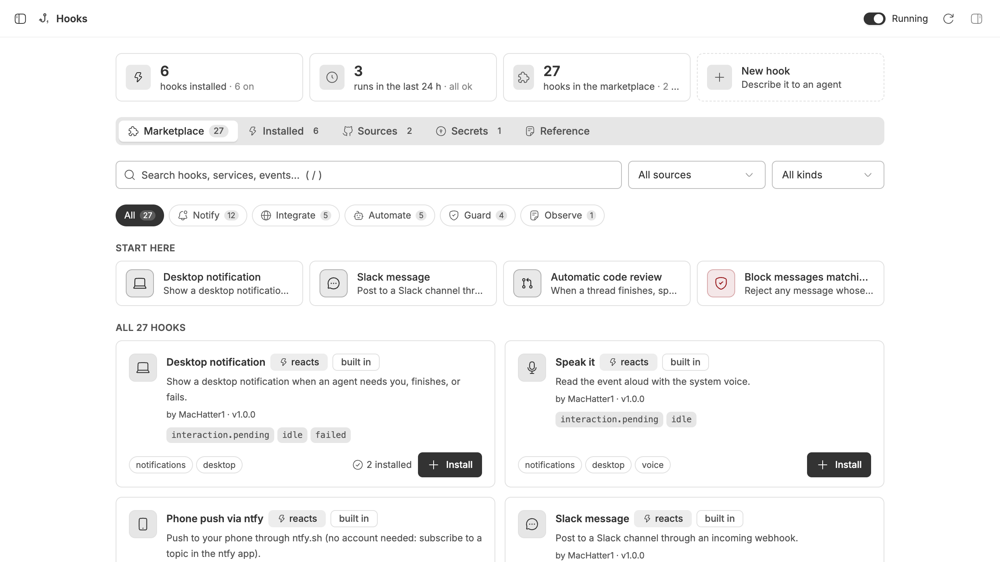
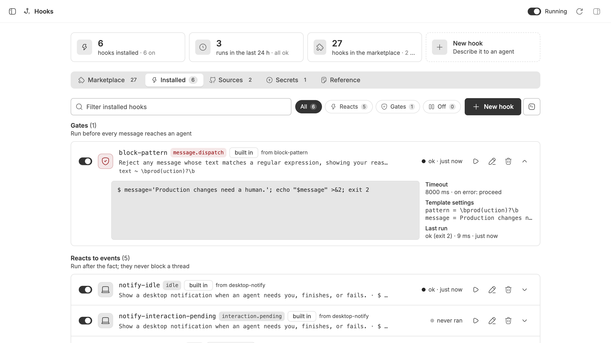
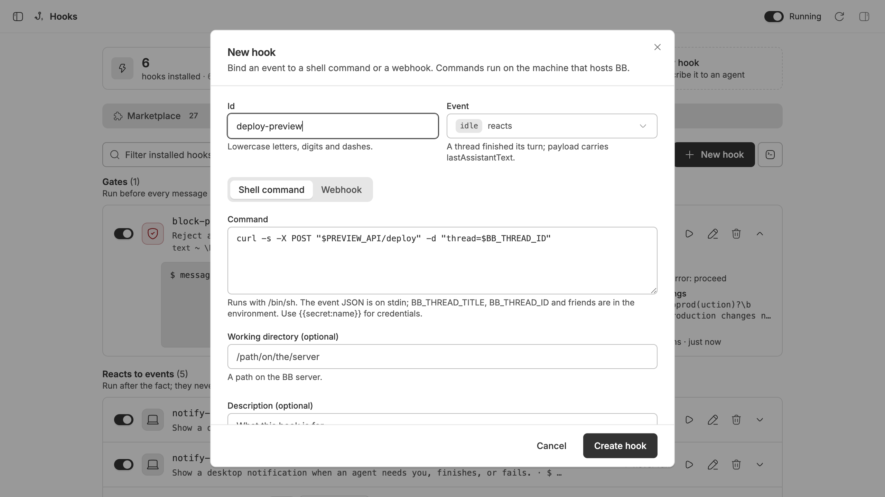
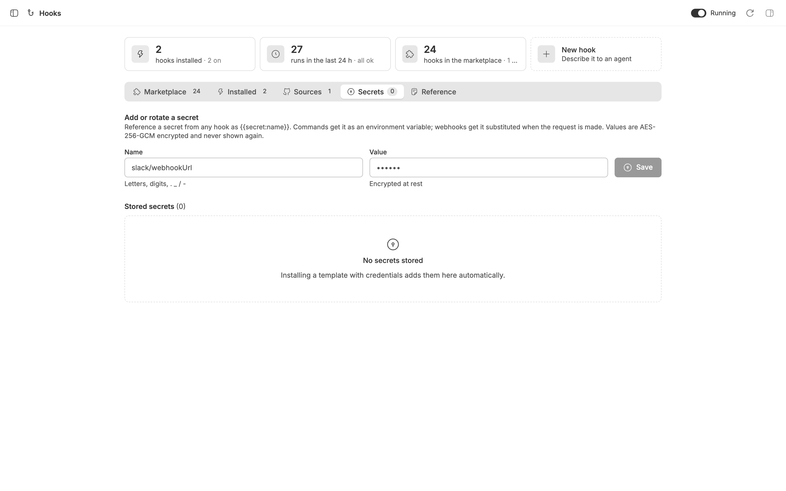
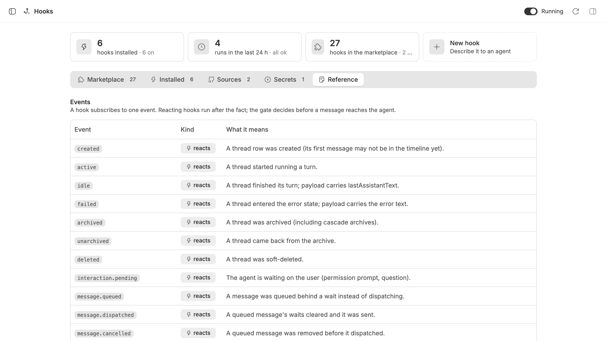
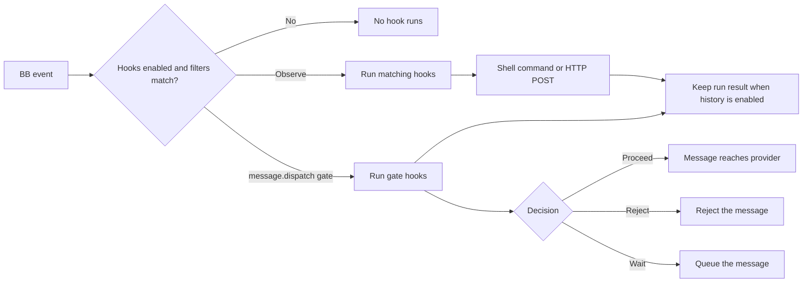

<div align="center">


# Hooks

### Automate thread events. Gate messages on your terms.

Run shell commands or call webhooks when BB events happen.<br>
Control message dispatch and inspect hook runs from one place.


[The problem](#the-problem) · [Features](#features) · [Install](#install) · [Where to find it](#where-to-find-it) · [How it works](#how-it-works) · [Privacy and control](#privacy-and-control) · [CLI](#cli) · [Settings](#settings) · [Development](#development) · [Licence](#licence)

<br>



</div>

<br>

> [!NOTE]
> Screenshots are real BB captures populated with fictional demo data.

## The problem

Without Hooks, you have to connect BB events to your own scripts and keep those integrations in sync. Messages also go straight to the agent unless you build a separate dispatch gate.

Hooks gives you one place to create, test and manage those automations.

|  | Without Hooks | With Hooks |
| --- | --- | --- |
| React to thread events | Check manually or wire up a separate integration | Run a command or send a webhook |
| Control message dispatch | No custom gate | Proceed, reject or wait before the message reaches the provider |
| Set up common integrations | Write each hook yourself | Configure a template, or add one from a catalog |

## Features

<table>
<tr>
<td width="50%" valign="top">

### 🪝 React to BB events

Run shell commands or send HTTP requests when threads start, finish, fail, need you, or change state.

</td>
<td width="50%" valign="top">

### 🛡️ Gate message dispatch

Check each outgoing message before it reaches the provider. Let it through, reject it with a reason, or wait.

</td>
</tr>
<tr>
<td valign="top">

### 🧰 Start from a template

Use built-in notifications, chat integrations, follow-up threads, review hooks, and message gates. Add community catalogs when you need more.

</td>
<td valign="top">

### 🔐 Keep secrets encrypted

Store credentials separately from hook definitions. Commands receive secrets as environment variables; webhooks substitute them when sending a request.

</td>
</tr>
<tr>
<td valign="top">

### 🧭 Manage hooks in BB

Browse the marketplace, edit and test installed hooks, manage catalog sources and secrets, and inspect recent runs from the Hooks page.

</td>
<td valign="top">

### 🤖 Work from the CLI or an agent

Use `bb hooks` in a terminal. The bundled skills help agents create hooks from a request, test them and explain the result.

</td>
</tr>
</table>

<div align="center">
<table>
<tr>
<td align="center"><br><sub><b>Manage and test installed hooks</b></sub></td>
<td align="center"><br><sub><b>Configure a hook in the editor</b></sub></td>
</tr>
<tr>
<td align="center"><br><sub><b>Store and rotate credentials</b></sub></td>
<td align="center"><br><sub><b>Look up events and payloads</b></sub></td>
</tr>
</table>
</div>

## Install

```sh
bb plugin install git:https://github.com/MacHatter1/bb-plugin-hooks --yes
```

This repository is private. Git installs need GitHub credentials on the machine running BB.

<details>
<summary><b>Install from a local clone</b></summary>

```sh
git clone https://github.com/MacHatter1/bb-plugin-hooks.git
cd bb-plugin-hooks
npm install && bb plugin build
bb plugin install path:$PWD --yes
```

</details>

**Requirements**

- bb **0.43+** (runtime SDK **0.4.87+**; development pin **0.5.9**)
- Node.js and npm for a local build

## Where to find it

| Where | What |
| --- | --- |
| **Sidebar → Hooks** | Browse templates, manage installed hooks and catalogs, store secrets, and read the reference. |
| **Composer → + → Create a hook** | Describe what you want; a new thread opens with the bundled `create-hook` skill. |
| **Settings → Installed plugins → Hooks** | Inspect or edit the hooks JSON setting. |
| **Terminal or agent** | Run `bb hooks` to manage, test and inspect hooks. |

## How it works



- **One shared definition.** The Hooks page, settings and `bb hooks` all manage the same hook list.
- **Runs on the BB server.** Commands receive event JSON on stdin; webhooks get a JSON POST, with an optional body template. Commands do not run inside the thread's environment.
- **Filter and bound runs.** Match by project, provider, title or text. Hooks without a custom timeout default to 30 seconds; the maximum is 10 minutes, and dispatch gates are capped at 8 seconds.
- **Choose the gate outcome.** Exit codes `0`, `2` and `3` mean proceed, reject and wait. A JSON decision on the last output line is also supported; errors proceed by default unless you set `onError`.

## Privacy and control

- 🖥️ **Commands run with the BB server's access.** They run on the machine hosting BB, as its user; review commands and catalog templates before installing them.
- 🔑 **Secrets stay out of hook definitions.** Values are encrypted with AES-256-GCM in the plugin database and resolved only when a hook runs.
- 🌐 **You choose the plugin's HTTP destinations.** URL hooks send event JSON to the endpoint you configure. Shell commands run with the server user's access and can make their own network requests. Configured catalogs are fetched by the server; catalog templates require confirmation before installation.
- ⏱️ **Gate hooks have a time limit.** Each gate run is capped at 8 seconds so it cannot hold message dispatch indefinitely.

## CLI

```sh
bb hooks templates
bb hooks use desktop-notify
bb hooks list
bb hooks add no-prod --event message.dispatch --command 'echo "Production needs a human." >&2; exit 2'
bb hooks test no-prod
bb hooks history --limit 20
```

<details>
<summary><b>All commands</b></summary>

| Command | Does |
| --- | --- |
| `list [--json]` | List installed hooks. |
| `events [--json]` | List events and their meanings. |
| `templates [<template>] [--search <text>] [--json]` | Search templates or show one. |
| `use <template> [--set key=value]… [--id id] [--event event]… [--project id] [--provider id] [--title regex] [--text regex] [--disabled] [--yes]` | Create hooks from a template. Catalog templates require `--yes`. |
| `marketplace list\|add <src>\|remove <src>\|refresh [src]\|search <text>\|validate <src>\|init [--name catalog]` | Manage and validate catalog sources. |
| `secrets list\|set <name> <value>\|remove <name>` | Manage encrypted secrets. |
| `show <id>` | Show a hook as JSON. |
| `add <id> --event <event> (--command <shell> \| --url <url>) [--project id] [--provider id] [--title regex] [--text regex] [--timeout ms] [--cwd dir] [--header k=v]… [--on-error proceed\|reject\|wait] [--description text] [--disabled]` | Create a hook. |
| `edit <id> [same flags as add] [--clear-match]` | Change a hook. |
| `enable <id>` / `disable <id>` | Enable or disable a hook. |
| `remove <id>` | Delete a hook and secrets used only by it. |
| `test <id> [--thread <thread_id>] [--json]` | Run a hook with a sample payload or a real thread. |
| `history [--limit n] [--hook id] [--json]` / `history clear` | Read or clear run history. |
| `export <id>` | Print a hook as a template for a catalog. |

</details>

**Agent access:** BB registers the `bb hooks` CLI for agents. The bundled [hooks skill](skills/hooks/SKILL.md) documents events and commands; [create-hook](skills/create-hook/SKILL.md) guides an agent from a request through a tested hook.

## Settings

Configure with `bb plugin config hooks`, or **Settings → Installed plugins → Hooks**.

<details>
<summary><b>All settings</b></summary>

| Setting | Default | Effect |
| --- | --- | --- |
| `hooks` | `[]` | Validated JSON array of hook definitions. |
| `enabled` | `true` | Master switch. Off keeps definitions but runs no hooks. |
| `historyLimit` | `200` | Number of runs to keep; `0` disables history. Range: 0–10,000. |
| `maxConcurrent` | `8` | Maximum concurrent observe-hook runs; applies after reload. Range: 1–64. |
| `webhookSecret` | unset | Optional HMAC-SHA256 signing secret for webhook requests. |
| `catalogs` | `starter` and `MacHatter1/bb-hooks-marketplace` | Catalog sources, one per line. The plugin refreshes them periodically. |
| `secretsKey` | generated on first load | Encryption key for stored secrets. Changing it makes existing secrets unreadable. |

</details>

<details>
<summary><b>Turning it off</b></summary>

Use the switch in the Hooks page to pause runs while keeping the plugin enabled. To disable or remove the plugin:

```sh
bb plugin disable hooks
bb plugin enable hooks
bb plugin remove hooks
```

</details>

## Development

```sh
npm install
npm test
npm run typecheck
bb plugin build
bb plugin install path:$PWD --yes
bb plugin dev
```

```text
server.ts   settings, RPC, CLI and event listeners
app.tsx     sidebar, settings and composer slots
src/        hook definitions, runner, secrets, catalogs and UI
components/ shared UI components
skills/     bundled agent skills
assets/     icon, screenshots and social preview
docs/       README logo
```

**Tests** cover definitions, template rendering, catalog behaviour, secret storage, the runner and server event handling with a fake plugin host.

`PLUGIN_OVERVIEW.md` is the store listing. Keep it in step with `bb.description` in `package.json`.

## Licence

[MIT](LICENSE)
